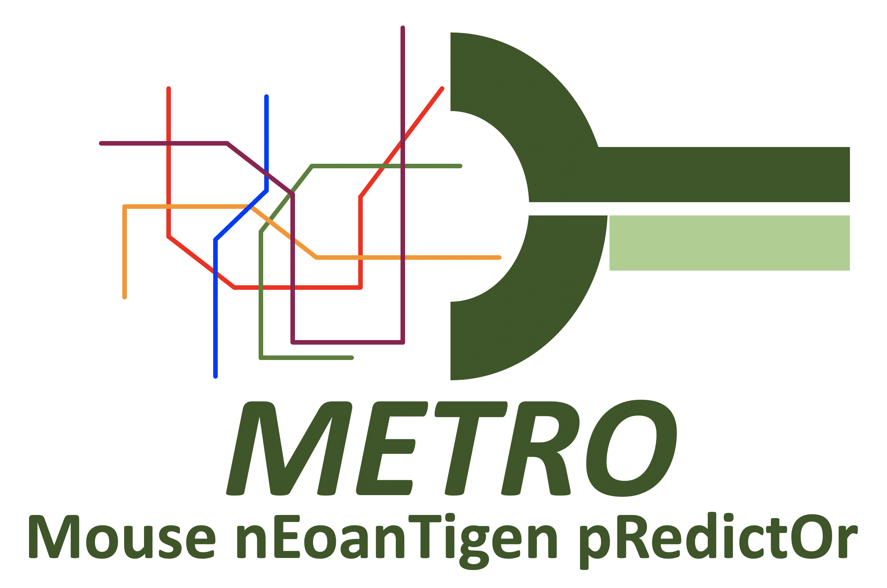

<div align="center">
  
  
  [](https://zenodo.org/badge/latestdoi/387896760)

  [](https://github.com/CCBR/METRO/releases)  [](https://github.com/CCBR/METRO/issues) [](https://github.com/CCBR/METRO/blob/master/LICENSE)  

</div>
  
### 1. Introduction  

**M**ouse n**E**oan***T***igen p**R**edict***O***r pipeline, as known as `METRO` (formerly AASAP), is a pipeline to characterize the effect of a mutation on an amino acid sequences and to predict the binding of peptides to any MHC molecule using netMHCpan. 

METRO takes a VCF file(s) and performs filtering and pre-processing for the pipeline input. Then, an MAF-like file containing HGVS terms describing a given mutation and a FASTA file containing transcript sequences are used to determine the consequence of a mutation on a protein product. The `build` sub command can be used to generate a FASTA file containing CDS sequence of each transcript. The `input` sub command will merge and filter MAF files based on user-provided parameters. The `run` sub command will parse and tokenize HGVS terms describing coding DNA mutations. METRO supports each major class of HGVS terms encoding for coding DNA mutations: substitution, deletion, insertions, duplications, and INDELS. METRO _does not_ support HGVS tokenization of terms describing mutations in non-exonic (or non-CDS) regions like introns, 3'-UTR or 5'-UTR. METRO will mutate a given coding DNA sequence based on the provided HGVS term and will translate that sequence into an amino acid sequence. METRO will also truncate a given amino acid sequence +/- N amino acids relativve to a given mutation start site. The `predict` sub command will take the output of the `run` sub command and utilize [netMHCpan](https://services.healthtech.dtu.dk/service.php?NetMHCpan-4.1) to make predictions related to the mutations identified. In addition, it will filter and prepare outputs based on user-provided parameters.

### 2. System Requirements

`metro` executable is composed of several inter-related sub commands. The `build` sub command requires that `samtools`, `gffread` from the cufflinks, and `python` are installed on the target system. the `predict` sub command requires that [netMHCpan](https://services.healthtech.dtu.dk/service.php?NetMHCpan-4.1) is available in user's $PATH. A virtual environment containing the required python packages to run metro can be built from our `requirements.txt`. METRO is compatiable with `python>=2.7` and `python>=3.5` (with preference to the latter).

If you are on biowulf, these dependencies can be met by running the following command:
```bash
# Grab an interactive node
# Do not run metro on the head node!
srun -N 1 -n 1 --time=12:00:00 -p interactive --mem=8gb  --cpus-per-task=4 --pty bash
module purge
module load cufflinks samtools python/3.5
```

### 3. Usage

For usage, and example code with test data, please visit the [METRO docs](https://ccbr.github.io/METRO/) page.